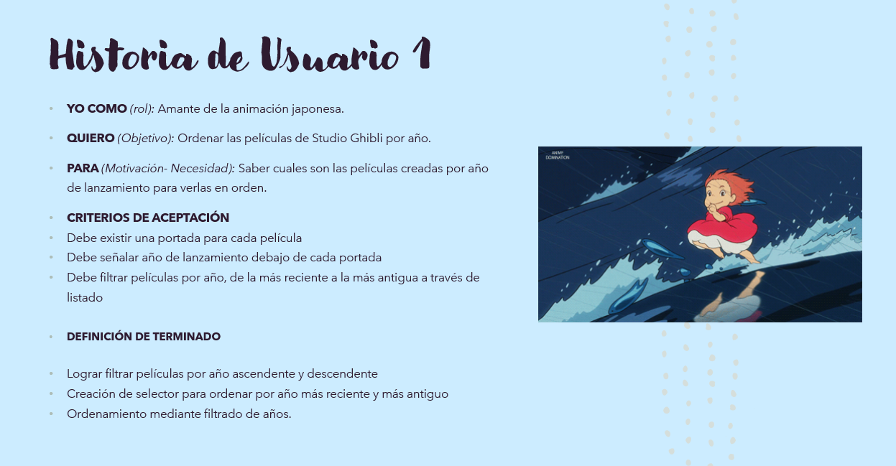
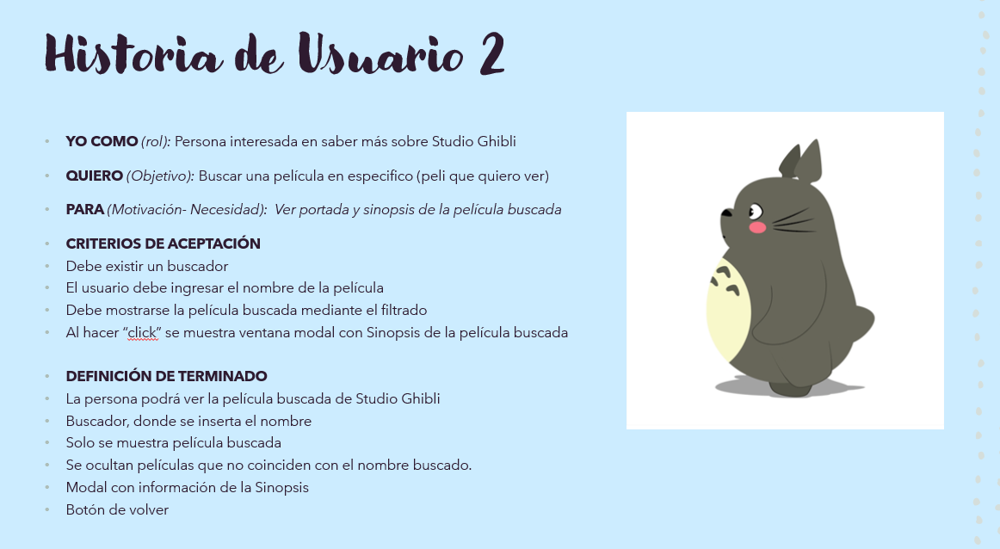

# **Data Lovers - Studio Ghibli**

### ***Principales usuarios del producto***
* los usuarios principalmente son adolescentes, aunque hoy por hoy existe un amplio público de todas las edades, que es seguidor de este tipo de animaciones japonesas.

### ***¿Cuáles son los objetivos de estos usuarios en relación con el producto?***
* Que el usuario pueda obtener mas datos relevantes sobre las peliculas, sinopsis y personajes

### ***¿Cuáles son los datos más relevantes que quieren ver en la interfaz y por qué?***

* Poder ver información relevante y ordenar todas las peliculas de Studio Ghibli. Ver los detalles de cada pelicula (año de lanzamiento y sinopsis).

### ***¿Cuándo utilizan o utilizarían el producto?***

* Los usuarios nuevos/seguidores ingresaran a la web para obtener la información deseada. Y los seguidores antiguos, para poder saber informacion relevante de cada pelicula como detalles de años y sinopsis, score u otro.

# *Historias de usuario*

### ***Historia de Usuario 1***

### ***Historia de Usuario 2***

# *Diseño de interfaz de usuario*

### ***Prototipo de baja fidelidad***

### ***Prototipo de Alta fidelidad***

